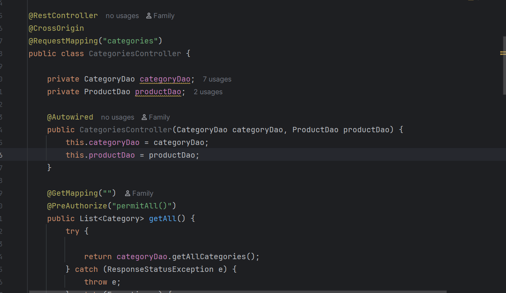
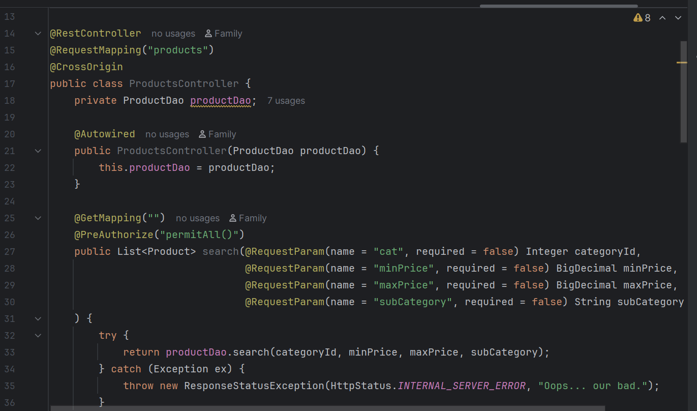
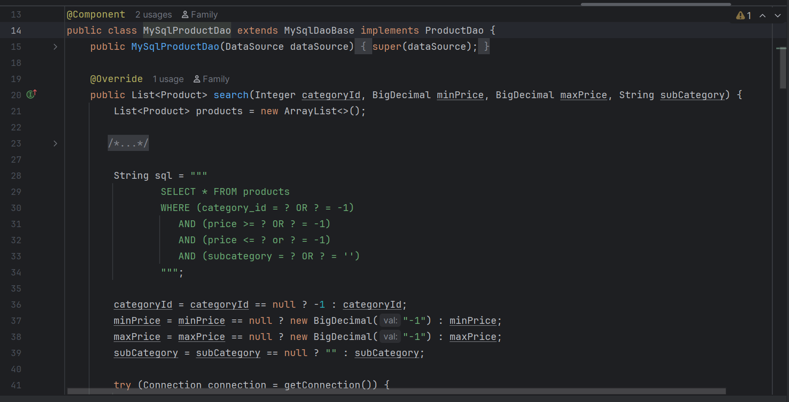
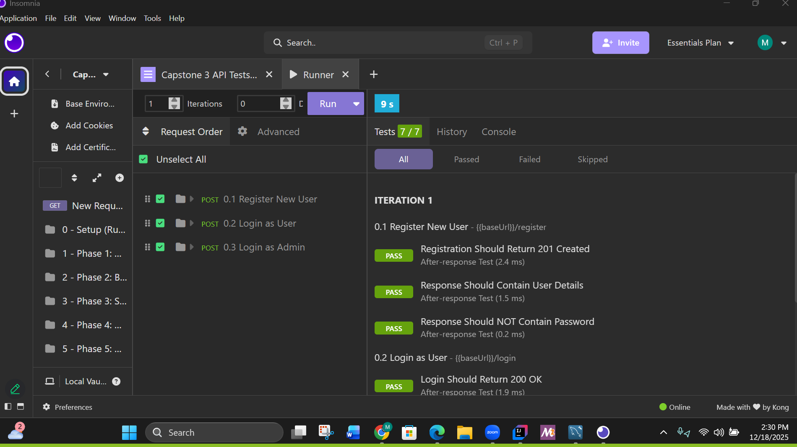
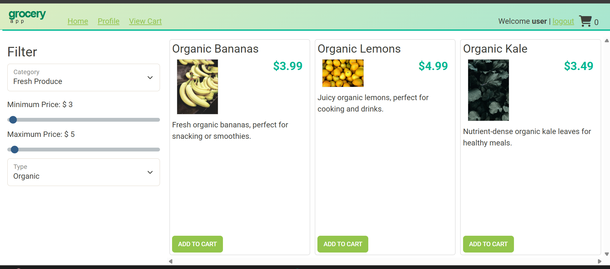
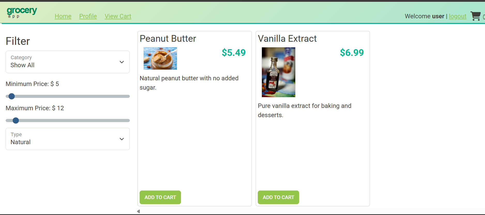

# Project Title Grocery Shop
## Description of the Project
Java project built with Spring Boot. It’s an online store API where users can register, log in, browse products, and manage their shopping cart. Admins can add, update, or delete products and categories. The project uses secure login with JWT tokens and connects to a MySQL database.
## User Stories

- As a user, I want to view a list of all product categories, So that I can browse products by category.
- As a user, I want to view details of a specific category, So that I understand what types of products it contains
- As an administrator, I want to create a new category, So that new types of products can be added to the store
- As an administrator, I want to update an existing category, So that category information stays accurate
- As an administrator, I want to delete a category, So that outdated or unused categories are removed
- As a user, I want to view all products, So that I can browse available items.

## Setup

Instructions on how to set up and run the project using IntelliJ IDEA.

### Prerequisites

- IntelliJ IDEA: Ensure you have IntelliJ IDEA installed, which you can download from [here](https://www.jetbrains.com/idea/download/).
- Java SDK: Make sure Java SDK is installed and configured in IntelliJ.

### Running the Application in IntelliJ

Follow these steps to get your application running within IntelliJ IDEA:

1. Open IntelliJ IDEA.
2. Select "Open" and navigate to the directory where you cloned or downloaded the project.
3. After the project opens, wait for IntelliJ to index the files and set up the project.
4. Find the main class with the `public static void main(String[] args)` method.
5. Right-click on the file and select 'Run 'YourMainClassName.main()'' to start the application.

## Technologies Used

- Java: Java: openjdk 17.0.12 2024-07-16.
- Tools: IntelliJ IDEA.Workshop, Exercise, ChatGPT and W3School

## Demo

## Future Work
- Improve search and filtering with advanced
- Build a full admin dashboard managing products and categories.
- Filtering by price
- Add item in shopping cart

## Resources
- W3School.com
- Workshop, Exercise
- Potato-Sensei

## Team Members

- **Name 1** Mohammad A Hussain

## Thanks

Express gratitude towards those who provided help, guidance, or resources:

- Thank you to [Nauman and Andy] for continuous support and guidance.
##### A special thanks to (Raymond)
